# Squid_Auth_Kerberos

## 1-Changing Hostnames
We start by executing this command
```
hostnamectl --static set-hostname kdc.insat
```
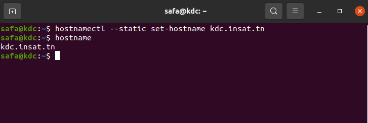

We do this step for the 2 other machines (service and client machines).

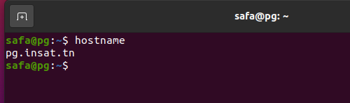

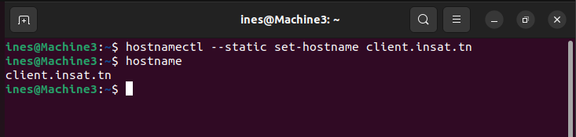

## 2- Getting IP Adresses
Now we need to get the IP Adresses of all the three machines. We can use this command to do that
```
hostname -I
```
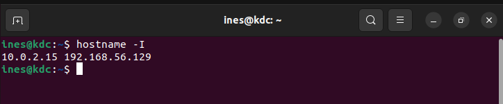

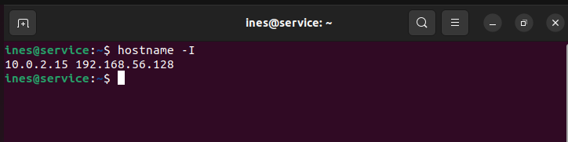


Note : All 3 machines need to have a Host-only Adapter.

## 3-Adding IP Adresses in /etc/hosts files

The next step is to add the IP adresses of the three machines in /etc/hosts files.
We execute this command : 
```
sudo nano /etc/hosts
```
and we add these 3 lines in the /etc/hosts file for all of 3 machines
```
192.168.56.129  kdc.insat.tn kdc
192.168.56.128  service.insat.tn service
192.168.56.130  client.insat.tn client
```

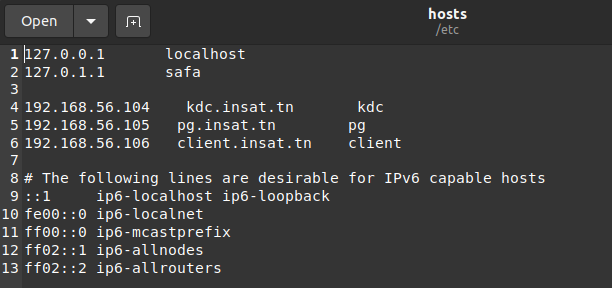

Now we can test our configuration by executing for example in kdc machine:
```
nslookup service
ping service
```
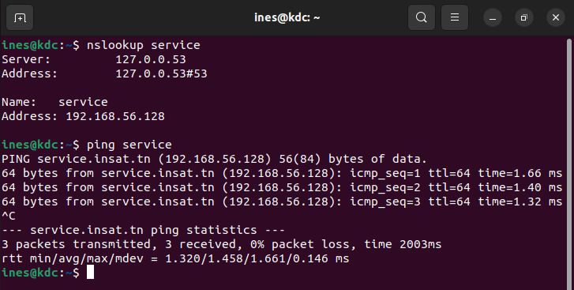

and in service machine: 
```
nslookup kdc
ping kdc
```
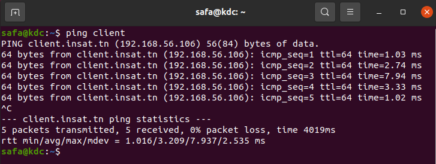

## 4-Setting The KDC

Now that all our 3 machines can communicate we need to set the KDC server.
We first start exectuing these commands in order to install krb5-kdc, krb5-admin-server and krb5-config libraries needed for this step:
```
sudo apt-get update
sudo apt-get install krb5-kdc krb5-admin-server krb5-config
```

When installing the packages, some prompts will appear in order to configure the KDC server

Realm : INSAT.TN (must be in uppercase)
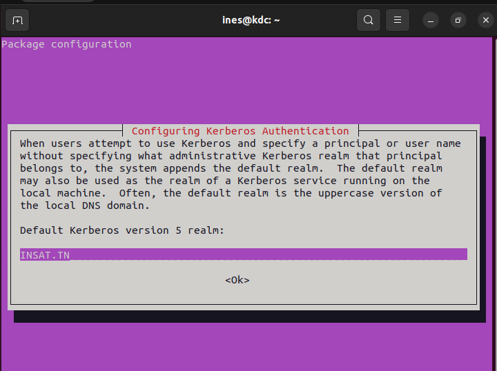

Kerberos server : kdc.insat.tn
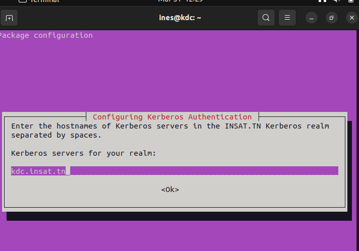

Administrative server : kdc.insat.tn (in our case it's the same as the kdc server)
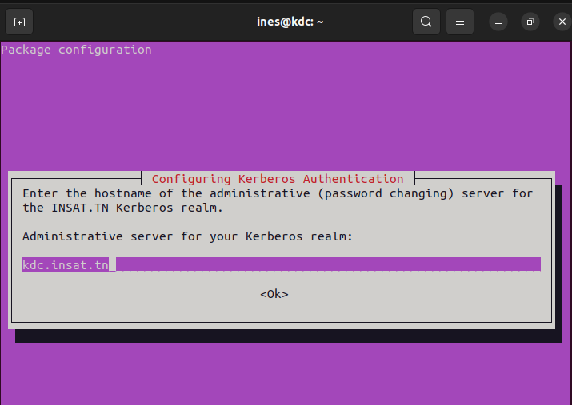

We now execute this command :
```
sudo krb5_newrealm
```
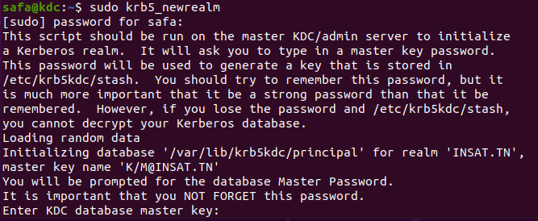

#### Adding The Principals:

Now we need to add the principals needed(users and services are considered as principals)

So we start with the admin principals:
```
sudo kadmin.local
kadmin.local:  add_principal root/admin
```
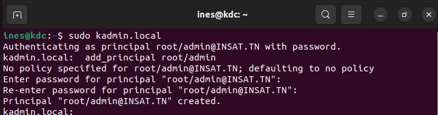

We verify that the principal is created
```
kadmin.local:  list_principals
```


Next, we need to grant all access rights to the Kerberos database to admin principal root/admin in the configuration file /etc/krb5kdc/kadm5.acl
```
sudo nano /etc/krb5kdc/kadm5.acl
```
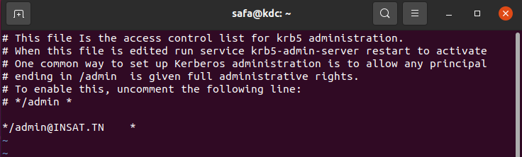

Now we create the other 2 principals with theses 2 commands : 
```
kadmin.local:  add_principal client
kadmin.local:  add_principal service/service.insat.tn
```
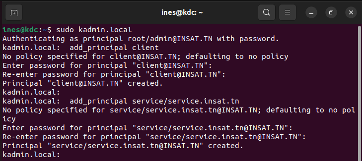

Now we verify if they were added successfully
```
kadmin.local:  list_principals
```
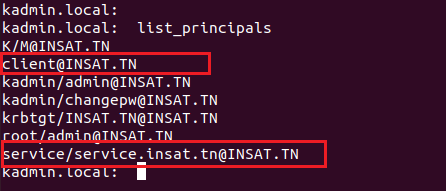

## 5-Setting The Service