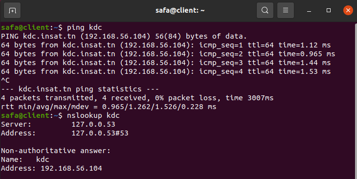
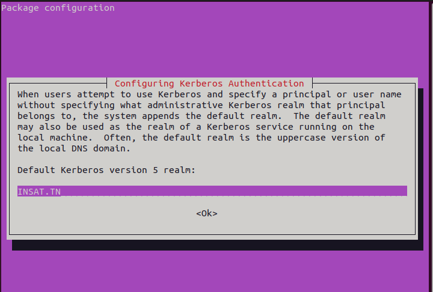
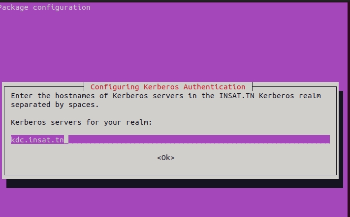
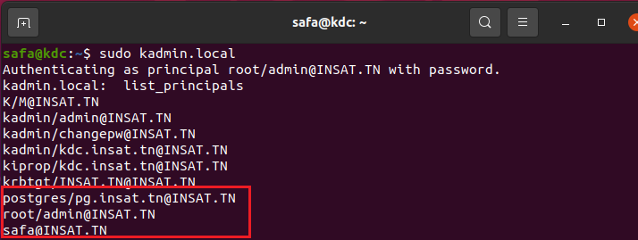
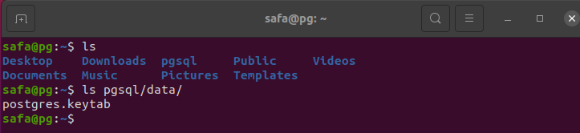
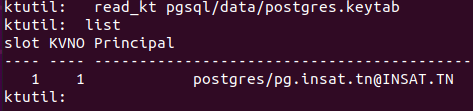

# Squid_Auth_Kerberos

Made by : 
[Amal Sammari](https://github.com/Amal1999)
[Safa Laabidi](https://github.com/safa-abidi)
[Ines Achour](https://github.com/inesachour)


## 1-Changing Hostnames
We start by executing this command
```
hostnamectl --static set-hostname kdc.insat
```


We do this step for the 2 other machines (service and client machines).


## 2- Getting IP Adresses
Now we need to get the IP Adresses of all the three machines. We can use this command to do that
```
hostname -I
```


Note : All 3 machines need to have a Host-only Adapter.

## 3-Adding IP Adresses in /etc/hosts files

The next step is to add the IP adresses of the three machines in /etc/hosts files.
We execute this command : 
```
sudo nano /etc/hosts
```
and we add these 3 lines in the /etc/hosts file for all of 3 machines
```
192.168.56.129  kdc.insat.tn kdc
192.168.56.128  service.insat.tn service
192.168.56.130  client.insat.tn client
```


Now we can test our configuration by executing for example in kdc machine:
```
nslookup service
ping service
```


and in service machine: 
```
nslookup kdc
ping kdc
```


## 4-Setting The KDC

Now that all our 3 machines can communicate we need to set the KDC server.
We first start exectuing these commands in order to install krb5-kdc, krb5-admin-server and krb5-config libraries needed for this step:
```
sudo apt-get update
sudo apt-get install krb5-kdc krb5-admin-server krb5-config
```

When installing the packages, some prompts will appear in order to configure the KDC server

Realm : INSAT.TN (must be in uppercase)


Kerberos server : kdc.insat.tn


Administrative server : kdc.insat.tn (in our case it's the same as the kdc server)


We now execute this command :
```
sudo krb5_newrealm
```


#### Adding The Principals:

Now we need to add the principals needed(users and services are considered as principals)

So we start with the admin principals:
```
sudo kadmin.local
kadmin.local:  add_principal root/admin
```


We verify that the principal is created
```
kadmin.local:  list_principals
```


Next, we need to grant all access rights to the Kerberos database to admin principal root/admin in the configuration file /etc/krb5kdc/kadm5.acl
```
sudo nano /etc/krb5kdc/kadm5.acl
```


Now we create the other 2 principals with theses 2 commands : 
```
kadmin.local:  add_principal client
kadmin.local:  add_principal service/service.insat.tn
```


Now we verify if they were added successfully
```
kadmin.local:  list_principals
```


## 5-Setting The Service

We start by installing those packages
```
sudo apt-get update
sudo apt-get install krb5-user libpam-krb5 libpam-ccreds
```

the same prompts as in the KDC server will appear and we need to enter the same informations used for the KDC server.
 - Realm : INSAT.TN
 - Kerberos Server : kdc.insat.tn
 - Administrative Server : kdc.insat.tn


Now let's create the keytab
```
ktutil 
ktutil:  add_entry -password -p service/service.insat.tn@INSAT.TN -k 1 -e aes256-cts-hmac-sha1-96
ktutil:  wkt service.keytab
```


We need to send the keytab from the KDC machine to the Service machine.
To do that we need to install openssh server with this command
```
sudo apt-get install openssh-server
```

In Service machine, we create a folder named "service" to store the keytab
```
mkdir service
```

then we go back to the KDC server send the file with this command
```
scp service.keytab ines@service.insat.tn:/home/service
```


We can verify in the Service machine if the keytab file was successfully sent


We now execute these commands to verify that the service principal was succesfully extracted from the KDC database
```
ktutil
ktutil:  list
ktutil:  read_kt service/service.keytab
ktutil:  list
```


#### Installing and Configuring Squid
Squid is a popular open-source caching proxy server that can be used to improve the performance of web servers by caching frequently accessed web pages and serving them from memory instead of fetching them from the web server each time they are requested.

To install we execute :
```
sudo apt-get upgrade
sudo apt-get install squid
```

To configure it
```
sudo gedit /etc/squid/squid.conf
```
we add those lines in the file
``` 
auth_param negotiate porgram /usr/lib/squid/negotiate_kerberos_auth -r INSAT.TN
auth_param negotiate children 10
auth_param neogtiate keep_alive on
acl auth proxy_auth REQUIRED
http_access allow auth
```


## 6-Setting The Client Machine
We start by installing those packages (same as the service server)
```
sudo apt-get update
sudo apt-get install krb5-user libpam-krb5 libpam-ccreds
```

the same prompts as in the KDC server will appear and we need to enter the same informations used for the KDC server.
 - Realm : INSAT.TN
 - Kerberos Server : kdc.insat.tn
 - Administrative Server : kdc.insat.tn
